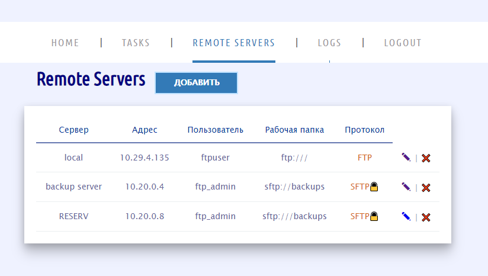
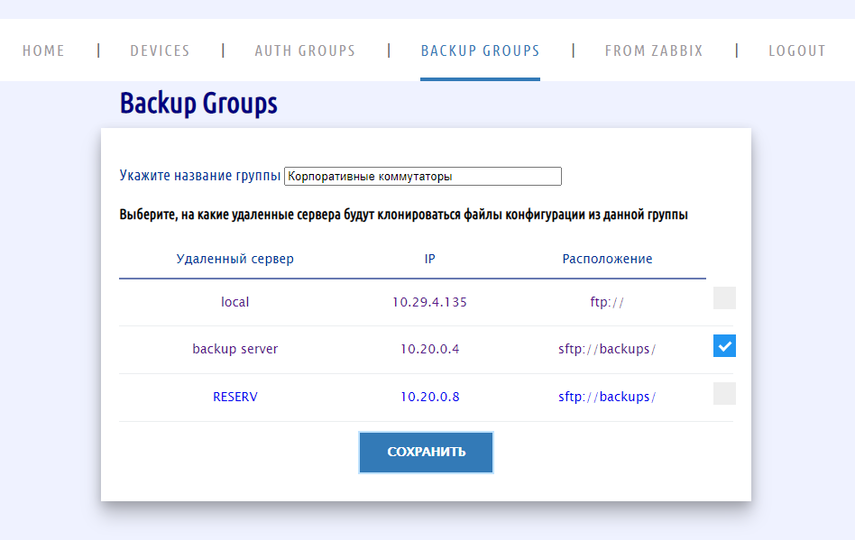
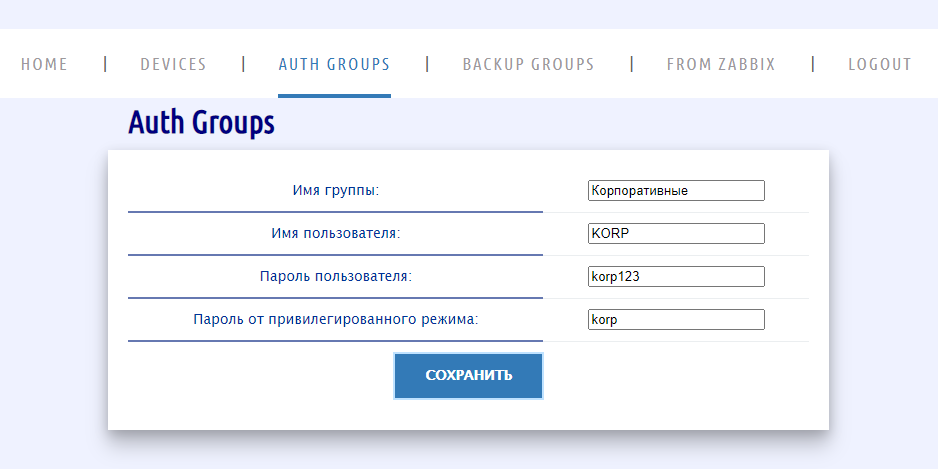
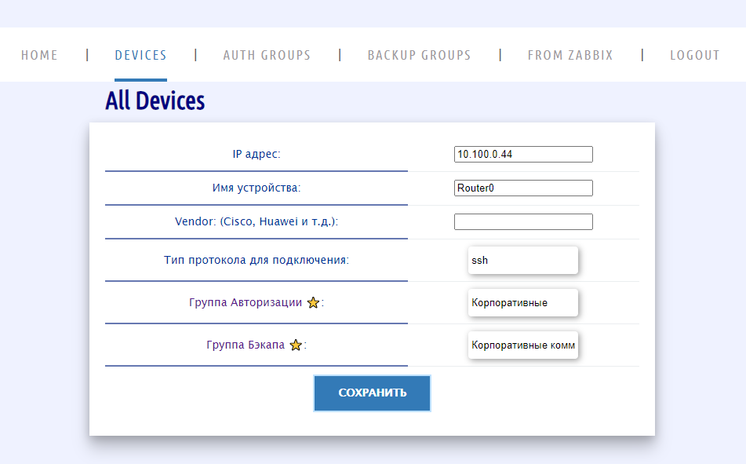
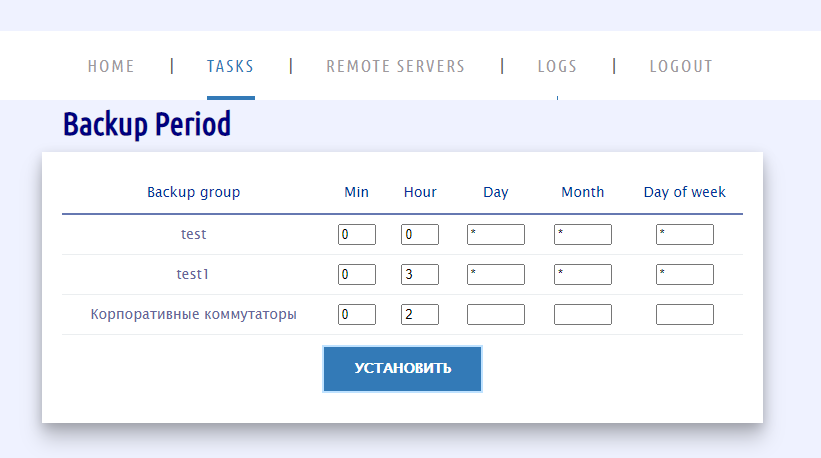
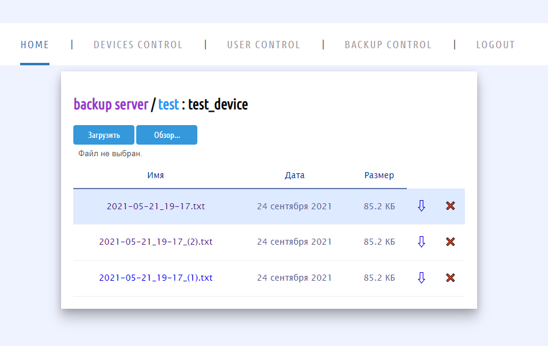

# CbP (Configuration backup Project)

Автоматизирует процесс сбора файлов конфигураций коммутаторов 
различных производителей с отправкой их на FTP-сервер.

---

## Установка

Скачиваем репозиторий и переходим в папку:

    git clone https://github.com/ig-rudenko/CbP.git && cd CbP

Запускаем docker-compose:

    docker-compose up -d

По умолчанию логин/пароль суперпользователя: root/password

Порт для подключения 8000

Для подключения к Zabbix необходимо заполнить соответствующий раздел в файле конфигурации `cbp.conf`

---
## Настройка
Для начала указываем на какие удаленные сервера будут отправляться файлы

**Отправлять файлы конфиругаций можно на нескольно серверов по 
протоколам FTP/SFTP**

Создаем группу резервного копирования, которая в дальнейшем будет 
содержать в себе список оборудования. 

Также указываем, на какие удаленные сервера будут отправляется 
файлы конфигураций из данной группы.

Для того, чтобы добавить оборудование, для начала необходимо создать 
группу авторизации (логин/пароль)

Добавляем оборудование и указываем созданные раннее группы 
авторизации и резервного копирования

(_Указание Vendor не является обязательным_)

Далее создаем период опроса для CRON

(Установим для группы "Корпоративные коммутаторы" ежедневный 
опрос в 02:00)

**Настройка завершена**

На главной странице будут показаны удаленные сервера и их группы резервного копирования

В группах находятся списки оборудования и их файлы конфигурации

Файл можно посмотреть, если он хранится в виде текстового файла

Также есть возможность загрузить свой файл конфигурации для каждого оборудования

---
## Связь с Zabbix

В файле конфигурации `cbp.conf` можно указать данные для подключения 
к Zabbix, чтобы не добавлять вручную оборудование.

Будет автоматически добавлена запись в базу данных с именем и 
IP адресом выбранного из Zabbix узла сети.

_Группа авторизации и группа резервного копирования будут 
указаны первые из доступного перечня_

