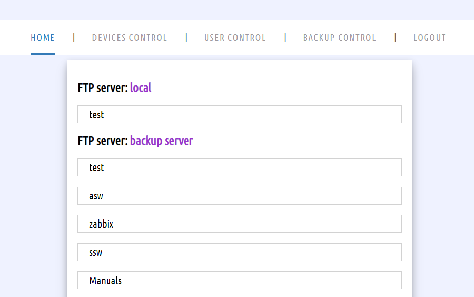
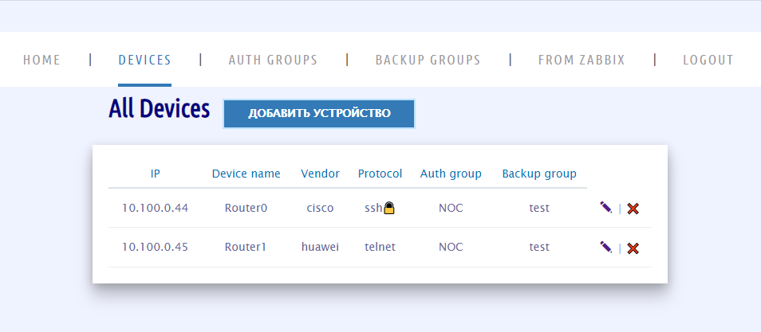

# CbP (Configuration backup Project)

Автоматизирует процесс сбора файлов конфигураций коммутаторов 
различных производителей с отправкой их на FTP-сервер.

---

## Установка

Скачиваем репозиторий и переходим в папку:

    git clone https://github.com/ig-rudenko/CbP.git && cd CbP

Создаем образ docker:

    docker image build -t cbp:0.7 .

Запускаем docker-compose:

    docker-compose up -d

По умолчанию логин/пароль суперпользователя: root/password

Порт для подключения 8000

Для подключения к Zabbix необходимо заполнить соответствующий раздел в файле конфигурации `cbp.conf`

---

